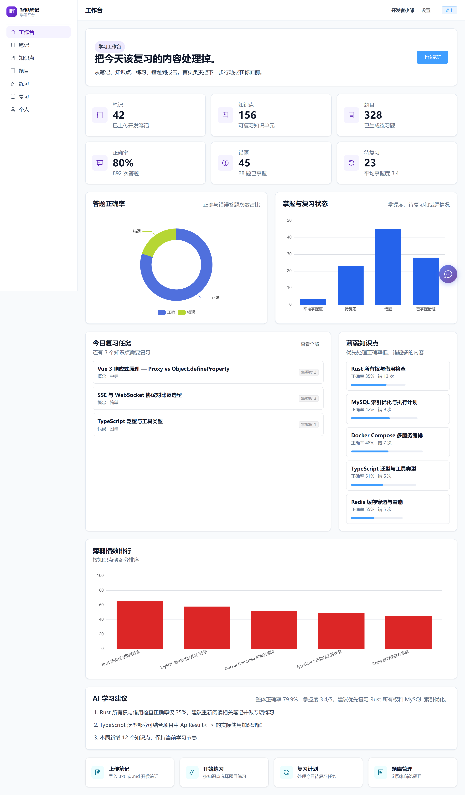
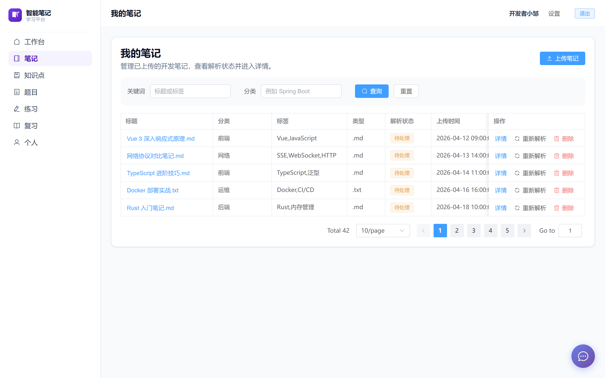
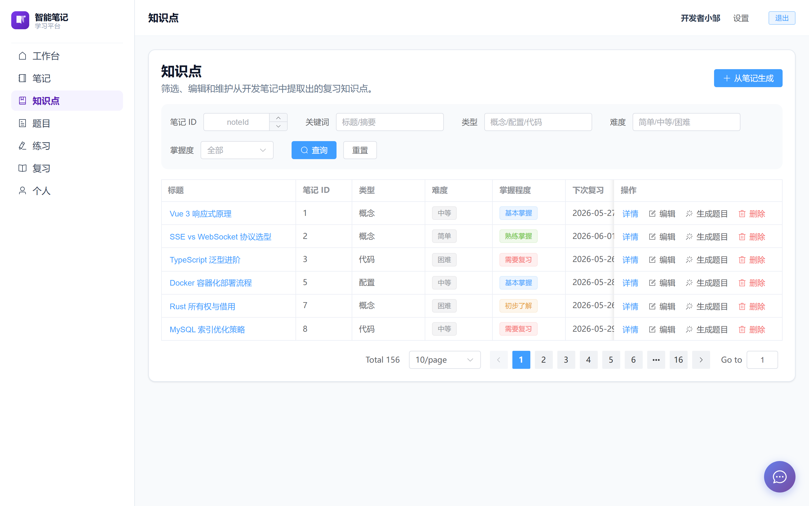
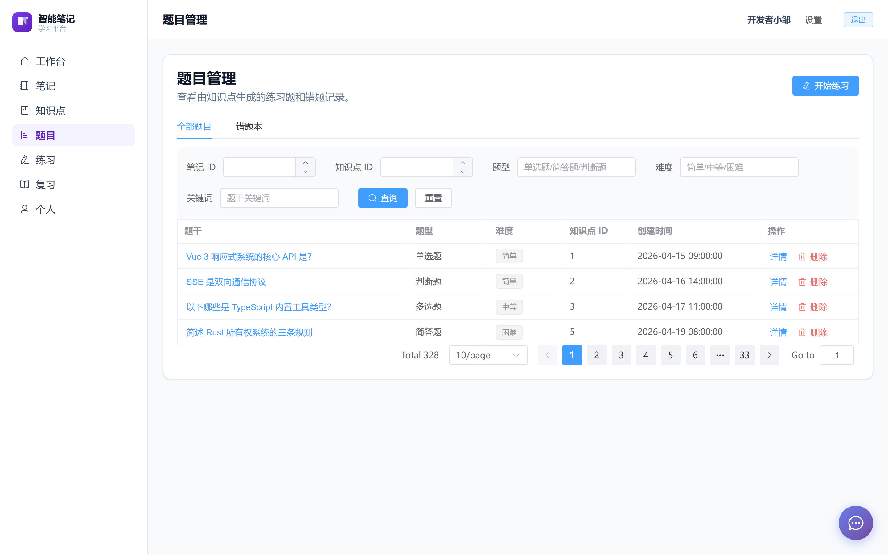
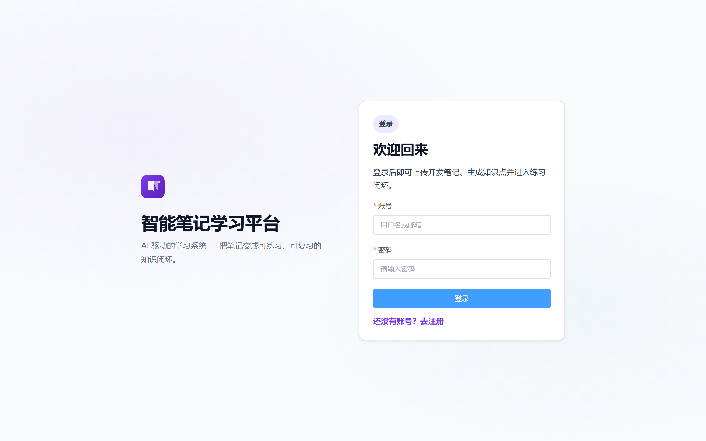
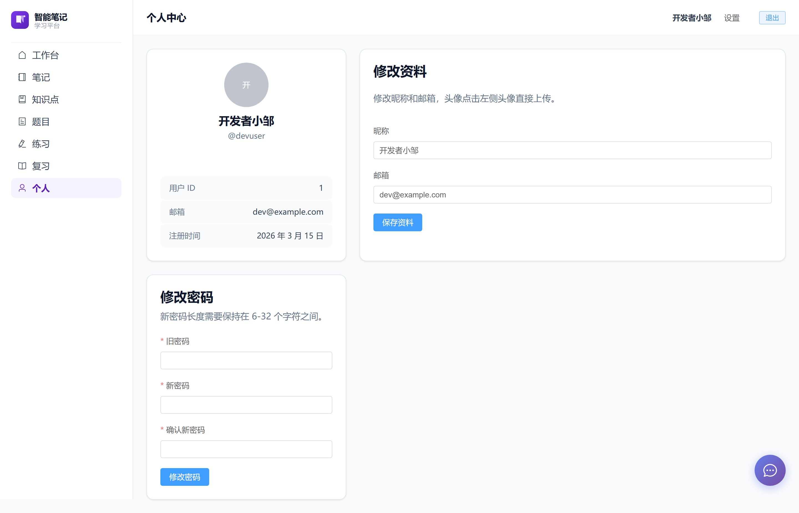
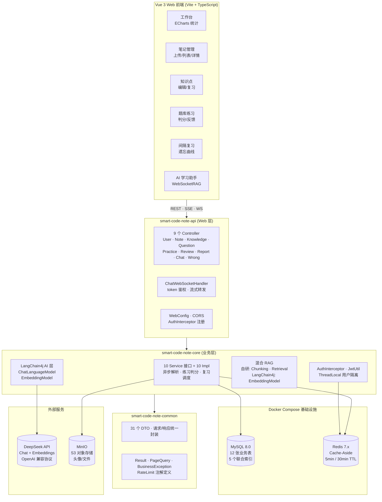
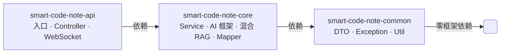

<div align="center">

# 📚 智能笔记服务系统

**AI 驱动学习平台 — LangChain4j · Maven 多模块 · 混合 RAG · 异步架构**

[](https://spring.io/)
[](https://openjdk.org/)
[](https://docs.langchain4j.dev/)
[](https://platform.deepseek.com/)
[](https://vuejs.org/)
[](https://www.mysql.com/)
[](https://redis.io/)
[](https://www.docker.com/)
[](https://min.io/)
[](https://swagger.io/)
[](https://en.wikipedia.org/wiki/Retrieval-augmented_generation)
[](https://github.com/spider-freedom/smart-code-note/actions)
[](LICENSE)

</div>

---

## 🏛️ 架构亮点

| 特性 | 描述 | 技术 |
|------|------|------|
| 🧠 **LangChain4j AI 层** | ChatLanguageModel + EmbeddingModel 框架抽象；模型热切换无需改业务代码 | `LangChain4j` + `OpenAiChatModel` |
| 📦 **Maven 多模块** | common（DTO/工具）→ core（业务/AI/RAG）→ api（控制器/入口）三层编译隔离 | Maven reactor |
| 🔄 **异步 AI 处理** | 笔记上传 ~200ms 返回；AI 知识提取 + 题目生成后台线程池异步执行 | `NoteAsyncService` + 3 workers |
| 🧠 **混合 RAG** | LangChain4j EmbeddingModel 向量化 + 自研中文分块 + 余弦检索 | `ChunkingService` 自研 + `EmbeddingModel` 框架 |
| ⚡ **三级缓存** | 用户信息 / 知识列表 / 学习概览；Cache-Aside 策略，热点命中率 ~70% | Spring Cache + Redis |
| 📊 **索引优化** | 5 个联合索引（user_id+create_time 等），列表查询 ~800ms → ~50ms | EXPLAIN + MySQL 索引 |
| 🚦 **限流保护** | AI 接口 10 次/分钟 per-user，Guava 令牌桶，超限 HTTP 429 | `@RateLimit` + AOP |
| 🐳 **容器化** | MySQL + Redis + MinIO 一键启动；`docker compose up -d` | Docker Compose |
| 📄 **API 文档** | Swagger UI 自动生成在线调试 | SpringDoc OpenAPI 2.8 |
| ⚙️ **工程规范** | HikariCP 连接池 · Graceful Shutdown · Actuator 健康检查 · 慢请求 >3s 告警 | HikariCP · Actuator · AOP |

---

## 📸 项目截图

### 工作台



*学习数据总览：今日任务、ECharts 图表、薄弱分析、AI 建议*

### 笔记上传



*上传 .md/.txt，后台异步 AI 解析，上传即返回不阻塞*

### 知识点管理



*AI 提取的结构化知识点，支持编辑难度、掌握程度、复习时间*

### 题目管理



*AI 自动生成单选/判断/主观题，错题自动归集*

### 登录 & 个人中心




*JWT 无状态认证 + 头像上传、个人信息编辑*

---

## ✨ 业务功能

| 模块 | 功能 |
|------|------|
| 🤖 | **AI 笔记解析** — 上传笔记 → 提取 3-5 个知识点 → 每知识点生成 5 道练习题 |
| 💬 | **AI 学习助手** — 多轮对话，RAG 检索笔记知识增强回答，WebSocket 实时推送 |
| 📝 | **在线练习** — 按笔记/知识点/题型筛选，AI 判分 + 答题反馈 |
| 🧠 | **间隔复习** — 遗忘曲线驱动，三档评分动态调整复习计划 |
| ❌ | **错题本** — 错题自动归集，支持重练和标记已掌握 |
| 📊 | **数据看板** — ECharts 图表 + 学习统计 + 薄弱环节分析 |

---

## 🛠️ 技术栈

| 层级 | 技术选型 |
|------|----------|
| **后端框架** | Spring Boot 3.5 · Java 17 · Maven 多模块 |
| **AI 框架** | LangChain4j 1.0-beta2 · ChatLanguageModel · EmbeddingModel |
| **LLM** | DeepSeek API（OpenAI 兼容）· Chat + Embeddings |
| **数据库** | MySQL 8.0 · H2（测试）· MyBatis-Plus 3.5.7 · HikariCP |
| **缓存** | Redis 7.x（Lettuce）· Spring Cache · Cache-Aside |
| **RAG** | 混合架构 — LangChain4j EmbeddingModel 向量化 + 自研中文分块 + 余弦检索 |
| **对象存储** | MinIO · S3 兼容 · Docker Compose 集成 |
| **通信** | REST API · SSE 流式 · WebSocket |
| **认证** | JWT（Auth0 java-jwt）· HMAC256 · 拦截器 · ThreadLocal |
| **限流** | Guava RateLimiter · 令牌桶 · AOP 注解 |
| **部署** | Docker Compose（MySQL + Redis + MinIO）· Graceful Shutdown |
| **文档** | SpringDoc OpenAPI 2.8 · Swagger UI |
| **CI** | GitHub Actions（backend compile + frontend build & test） |
| **监控** | Actuator · AOP 统一日志 · 慢请求 >3s 告警 |
| **前端** | Vue 3 · TypeScript · Vite · Element Plus · Pinia · ECharts |
| **测试** | JUnit 5 + MockMvc · Vitest + jsdom |

---

## 📐 系统架构



### Maven 模块依赖关系



---

## 🚀 快速启动

### Docker Compose（推荐）

```bash
git clone https://github.com/spider-freedom/smart-code-note.git
cd smart-code-note

# 1. 启动 MySQL + Redis + MinIO
docker compose up -d
# → MySQL :3306 · Redis :6379 · MinIO :9000 (console :9001)

# 2. 配置 API Key
cp .env.example .env
# 编辑 .env，填入 DEEPSEEK_API_KEY=sk-xxx

# 3. 后端
cd backend
export DEEPSEEK_API_KEY=sk-xxxxxxxx
mvn spring-boot:run -Dspring-boot.run.profiles=dev
# → http://localhost:8080 · Swagger: /swagger-ui.html

# 4. 前端（新终端）
cd frontend
npm install && npm run dev
# → http://localhost:5173
```

### 手动启动

| 依赖 | 版本 | 说明 |
|------|------|------|
| Java | 17+ | 后端运行 |
| Maven | 3.8+ | 后端构建 |
| Node.js | 18+ | 前端开发 |
| MySQL | 8.0+ | 数据存储 |
| Redis | 7.x | 缓存 |

```bash
cp .env.example .env  # 填入 DeepSeek API Key
cd backend && mvn spring-boot:run -Dspring-boot.run.profiles=dev
```

---

## 🧪 测试

```bash
# 后端（9 集成测试 — SpringBootTest + MockMvc + H2）
cd backend && mvn test

# 前端（24 用例 — SSE / Store / 组件）
cd frontend && npm test
```

---

## 🚢 部署

```bash
# 前端构建
cd frontend && npm run build

# 后端打包
cd backend && mvn clean package -DskipTests

# 生产运行
java -Dspring.profiles.active=prod \
     -DDEEPSEEK_API_KEY=sk-xxxxxxxx \
     -jar smart-code-note-api/target/smart-code-note-api-0.0.1-SNAPSHOT.jar
```

> 生产需配置 Nginx 反向代理 + HTTPS + SPA fallback + SSE / WebSocket 代理。

---

## 📄 License

MIT © 2025 [spider-freedom](https://github.com/spider-freedom)

---

<div align="center">
  <sub>Built with Spring Boot · LangChain4j · Vue 3 · MySQL · Redis · DeepSeek AI</sub>
</div>
